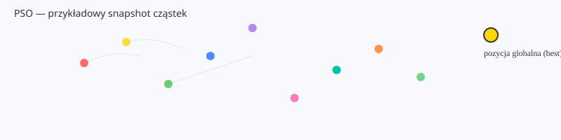

# Implementacja PSO — projekt końcowy

Krótki, czytelny opis implementacji algorytmu Particle Swarm Optimization (PSO) w języku C.

## Opis

To repozytorium zawiera implementację PSO wraz z narzędziami pomocniczymi do obsługi mapy, logowania i konfiguracji. Kod jest napisany w C i przygotowany do skompilowania za pomocą dostarczonego `Makefile`.

## Wymagania

- Kompilator C (np. `gcc`)
- `make`

## Budowanie

W katalogu projektu uruchom:

```bash
make
```

To powinno wygenerować plik wykonywalny (`main` lub zgodnie z konfiguracją `Makefile`).

## Uruchamianie

Użycie programu (wymagany argument: plik mapy):

```bash
./main <plik_mapy> -p <liczba_czasteczek> -i <liczba_iteracji> -c <plik_konfig> -n <zapisz_co_n>
```

Przykład:

```bash
./main test_map.txt -p 50 -i 200 -c pso_config.txt -n 10
```

Flagi i wartości domyślne:

- `-p` : liczba cząstek (domyślnie `30`)
- `-i` : liczba iteracji (domyślnie `100`)
- `-c` : plik konfiguracyjny z wartościami PSO (opcjonalny)
- `-n` : zapisz stan co N iteracji (domyślnie `1`)

Domyślne wartości współczynników PSO (jeśli nie użyjesz `-c`): `w = 0.5`, `c1 = 1.0`, `c2 = 1.0`.

## Pliki w repozytorium

- `main.c` — punkt wejścia programu.
- `pso.c`, `pso.h` — implementacja algorytmu PSO.
- `pso_config.txt` — przykładowa konfiguracja parametrów PSO.
- `obsluga_map.c`, `obsluga_map.h` — obsługa mapy/struktur danych wejściowych.
- `narzedzia_pomocnicze.c`, `narzedzia_pomocnicze.h` — funkcje pomocnicze.
- `logger.c`, `logger.h` — prosty logger zapisujący dane do `log.csv`.
- `log.csv` — (wynikowy) plik z logami/rezultatami (jeśli wygenerowany).
- `test_map.txt` — przykładowa mapa/test wejściowy.

## Konfiguracja (`pso_config.txt`)

Jeśli podasz plik konfiguracyjny przez `-c`, program wczyta trzy wartości zmiennoprzecinkowe: `w`, `c1`, `c2`.

Format pliku: trzy liczby oddzielone spacjami lub nowymi liniami, np.:

```text
0.6 1.2 1.2
```

gdzie:

- `w`  — współczynnik bezwładności
- `c1` — współczynnik przyciągania do najlepszej pozycji cząsteczki
- `c2` — współczynnik przyciągania do najlepszej pozycji globalnej

Jeśli plik nie zostanie podany lub nie zawiera poprawnych wartości, użyte zostaną wartości domyślne (`w=0.5`, `c1=1.0`, `c2=1.0`).

## Wyniki i logowanie

Domyślnie program zapisuje dane do `log.csv`. Możesz analizować ten plik lub użyć własnych narzędzi do wizualizacji wyników optymalizacji.

## Demo & galeria

Poniżej są dwa przykładowe obrazy (statyczne) pokazujące wygląd wyjścia i przykładowy snapshot cząstek PSO. Możesz podmienić je na zrzuty ekranu lub GIF-y wygenerowane podczas uruchomienia programu.




Jeśli chcesz, mogę wygenerować animowany GIF z serii snapshotów — daj znać.


## Testy

Do szybkiego testu użyj `test_map.txt` jako wejścia (jeżeli program obsługuje mapy z tego pliku). Uruchom program i sprawdź `log.csv` oraz wyjście w konsoli.

## Licencja

Ten projekt jest udostępniony na licencji MIT — zobacz plik `LICENSE`.

---

Autor: Jakub Madejski (2026), Michał Walentynowicz (2026)
